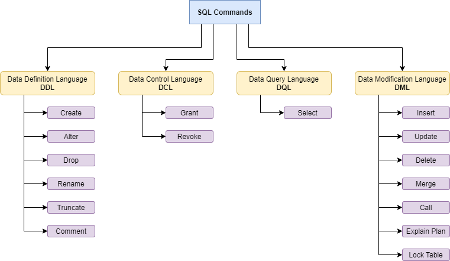
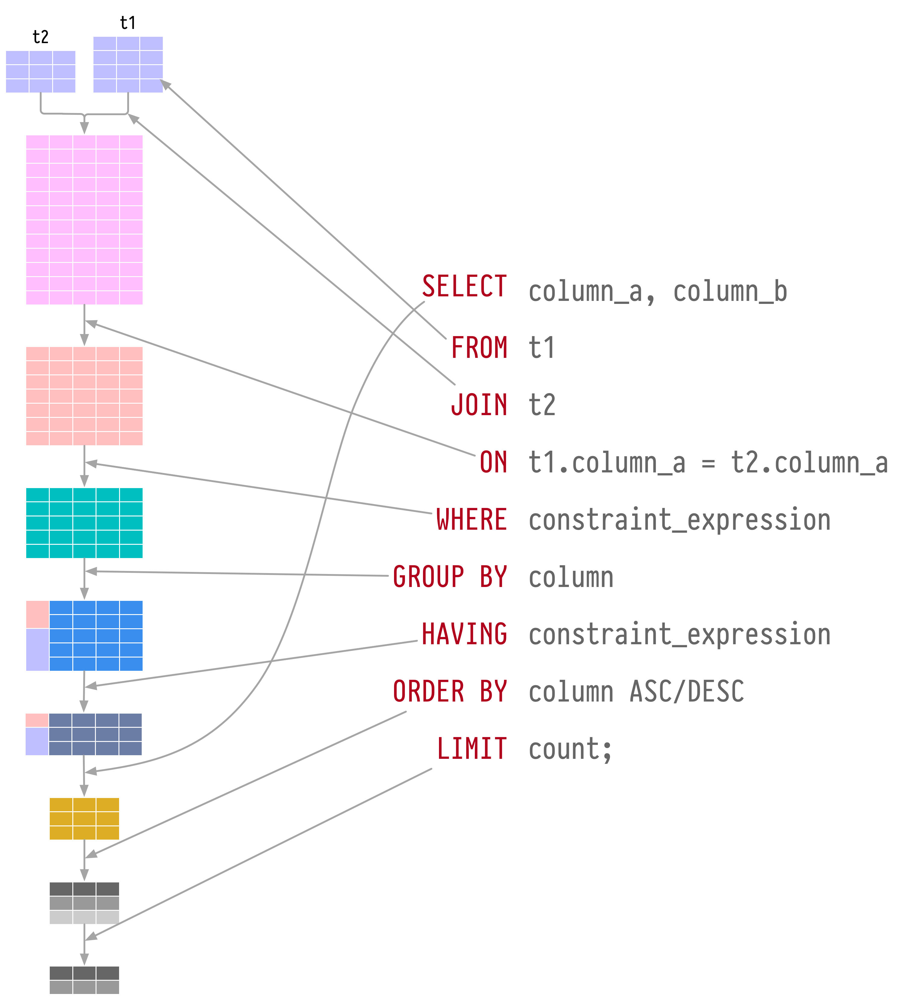
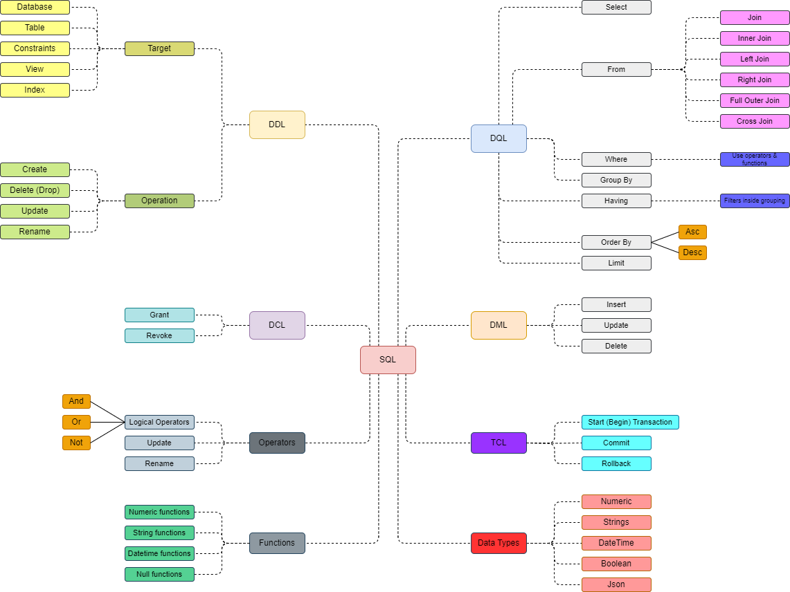

# SQL
### SQL Commands

    

 

#### DDL - Data Definition Language
[Wikipedia](https://en.wikipedia.org/wiki/Data_definition_language) - data definition or data description language (DDL) is a syntax for creating and modifying database objects such as tables, indices, and users.  

#### DCL - Data Control Language
[Wikipedia](https://en.wikipedia.org/wiki/Data_control_language) - a data control language (DCL) is a syntax similar to a computer programming language used to control access to data stored in a database (authorization).  

#### DQL - Data Query Language
[Wikipedia](https://en.wikipedia.org/wiki/Data_query_language) - data query language (DQL) is part of the base grouping of SQL sub-languages. These sub-languages are mainly categorized into four categories: a data query language (DQL), a data definition language (DDL), a data control language (DCL), and a data manipulation language (DML).  
Sometimes a transaction control language (TCL) is argued to be part of the sub-language set as well.  
DQL statements are used for performing queries on the data within schema objects. The purpose of DQL commands is to get the schema relation based on the query passed to it.  

#### DML - Data Modification Language
[Wikipedia](https://en.wikipedia.org/wiki/Data_manipulation_language) - data manipulation language (DML) is a computer programming language used for adding (inserting), deleting, and modifying (updating) data in a database.  

 

### Order of SQL query  

    

 

### The SQL Landscape

 

- commands, queries, etc
- relational algebra
- sets

 

    

 

### Transaction
A transaction is an executing program that forms a logical unit of database processing. A transaction *includes one or more database access operations* (these can include insertion, deletion, modification, or retrieval operations), executed as a *single unit of work*.  
If a transaction fails after executing some of its operations but before executing all of them, the operations already executed must be undone and have no lasting effect.  
The database operations that form a transaction can either be embedded within an application program or they can be specified interactively via a high-level query language such as SQL.

### ACID
An excellent illustration of ACID [here](https://www.youtube.com/watch?v=GAe5oB742dw) by [Sahn Lam](https://www.linkedin.com/in/sahnlam/).  

#### Atomicity
A transaction is an atomic unit of processing; it should either be performed in its entirety or not performed at all

#### Consistency
A transaction should be consistency preserving, meaning that if it is completely executed from beginning to end without interference from other transactions, it should take the database from one consistent state to another.

#### Isolation
 A transaction should appear as though it is being executed in isolation from other transactions, even though many transactions are executing concurrently. That is, the execution of a transaction should not be interfered
 with by any other transactions executing concurrently.

#### Durability
The changes applied to the database by a committed transaction must persist in the database. These changes must not be lost because of any failure

 

#### Indexing
Indexes are used to speed up the retrieval of records in response to certain search conditions.
Index structures are additional files on disk that provide secondary access paths, which provide alternative ways to access the records without affecting the physical placement of records in the primary data file on disk. 
They enable efficient access to records based on the indexing fields that are used to construct the index.  
Basically, any field of the file can be used to create an index, (and multiple indexes on different fields, as well as indexes on multiple fields) can be constructed on the same file.
A variety of indexes are possible; each ofthem uses a particular data structure to speed up the search.  
To find a record or records in the data file based on a search condition on an indexing field, the index is searched, which leads to pointers to one or more disk blocks in the data file where the required records are located.

#### Partitioning
Since storing all database records on a single node is rather unrealistic for the majority of modern applications, many databases use partitioning: a logical division of data into smaller manageable segments.  
The most straightforward way to partition data is by splitting it into ranges and allowing replica sets to manage only specific ranges (partitions).  
When executing queries, clients (or query coordinators) have to route requests based on the routing key to the correct replica set for both reads and writes. This partitioning scheme is typically called sharding: every replica set acts as a single source for a subset of data.

#### Sharding

#### Data files and Index files
A database system usually separates data files and index files: data files store data records, while index files store record metadata and use it to locate records in data Data Files and Index Files.

#### Data files
Data files (sometimes called primary files) can be implemented as index-organized  tables (IOT), heap-organized tables (heap files), or hash-organized tables (hashed files).  
Records in heap files are not required to follow any particular order, and most of the time they are placed in a write order. This way, no additional work or file reorganization is required when new pages are appended. Heap files require additional index structures, pointing to the locations where data records are stored, to make them searchable.  
In hashed files, records are stored in buckets, and the hash value of the key determines which bucket a record belongs to. Records in the bucket can be stored in append order or sorted by key to improve lookup speed.  
Index-organized tables (IOTs) store data records in the index itself. Since records are stored in key order, range scans in IOTs can be implemented by sequentially scanning its contents.
Storing data records in the index allows us to reduce the number of disk seeks by at least one, since after traversing the index and locating the searched key, we do not have to address a separate file to find the associated data record.  
When records are stored in a separate file, index files hold data entries, uniquely identifying data records and containing enough information to locate them in the data file. For example, we can store file offsets (sometimes called row locators), locations of data records in the data file, or bucket IDs in the case of hash files. In index-organized tables, data entries hold actual data records.

#### Index files
An index is a structure that organizes data records on disk in a way that facilitates efficient retrieval operations. Index files are organized as specialized structures that map keys to locations in data files where the records identified by these keys (in the case of heap files) or primary keys (in the case of index-organized tables) are stored.  
An index on a primary (data) file is called the primary index. However, in most cases we can also assume that the primary index is built over a primary key or a set of keys identified as primary. All other indexes are called secondary.  
Secondary indexes can point directly to the data record, or simply store its primary key. A pointer to a data record can hold an offset to a heap file or an index-organized table. Multiple secondary indexes can point to the same record, allowing a single data record to be identified by different fields and located through different indexes.  
While primary index files hold a unique entry per search key, secondary indexes may hold several entries per search key

